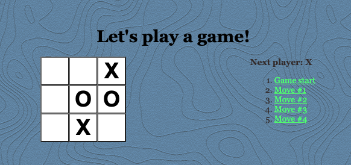

# Tic-Tac-Toe

This repository contains the code for existing tic-tac-toe game programming in JavaScript using React. You can see it running [here](https://pipe-mv.github.io/tic-tac-toe/).

* Lets you play tic-tac-toe.
* Indicates when one player has won the game.
* Stores the history of moves made throughout the game.

### Setting Up

* Fork or clone this repository.

* You can run this with `npm install` and then `npm start` from inside the directory.

Note that the moves past the one you jump to do not need to disappear off the list. That is to say, from a board that looks like this:

Clicking on `Move #1` causes the board to jump back in time to Move #1, but the move list has not changed.

However, from there, the game can be played and new moves can then be overwritten in its history.

Try it yourself in the solution link above.

### Hints

- In the code, a "move" is also referred to as a "step."
